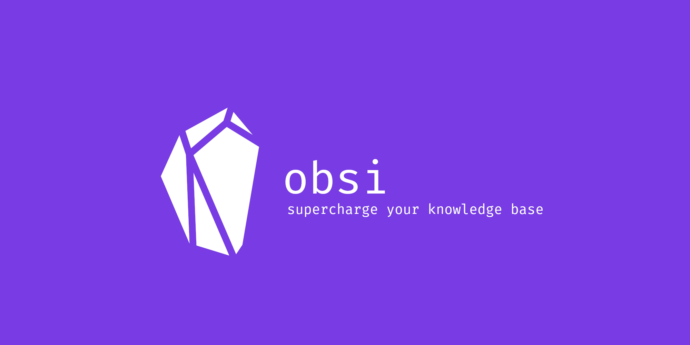

# obsi, supercharge your knowledge base
This is `obsi`, a command-line tool to supercharge markdown-based knowledge bases.
Originally used for markdown-based [Obsidian](https://obsidian.md) notes,
it works with every markdown-based tool for note-taking or digital gardening.
Examples of generated files from an exemplary vault can be found in the [example](example) directory.

## Features
Here's what obsi can do.

- Anki decks: create and update Anki Decks from your Obsidian Vault to memorize and re-visit notes.
- Indexing: create indexes for tags, i.e. pages that link to all pages with a specific tag.
- Machine Learning Recommendations: get tag recommendations (based on other tags) to make sure all pages are properly tagged.
- Calendar generation: daily, weekly, monthly, and yearly notes, created from a template you can edit, properly interlinked, for the next years to come. You don't have to manually create notes in your calendar ever again.

while doing this, obsi is:
- customizable with Jinja-based [templates](templates), so you can adapt everything to your needs
- easily extendable with Python, if you need more functionality
- fully containerized within Docker, no dependencies needed
- super careful with your vault and will never overwrite anything
- tool-independent to make sure, your notes stay truly text-based

## Obsi compared to...

- [Obsidian](https://obsidian.md): Obsidian is a program/app that allows you to interactively work with your markdown-files, it can be extended with many plugins that all run within Obsidian. obsi is command line based and works directly with your files for you. It's basically a text-focused extension of what you can do with Obsidian.
- [DataView](https://github.com/blacksmithgu/obsidian-dataview): DataView is an Obsidian addon which allows you to dynamically query your vault like a database. The results are shown in Obsidian. The issue is that they are not persisted and can thus not be used without Obsidian, e.g. when not using the app. To me, this was a huge drawback, as I wanted to have my notes tool-independent. Also, its functionality is limited to fetching data, not file-generation or even machine learning applications.

## Usage
Get obsi running with these five steps:

1. Fork and then clone this repo to your local machine
2. Adapt the [templates](templates) to your needs
3. Adapt the location of your notes in [docker-compose.yml](docker-compose.yml).
4. Spin it up with `make`. This will spin up a docker container and read your vault/notes.
5. Find the generated files in your desired "out" directory, e.g. [example/output](example/output), and copy them into your vault if desired.

## Feature Ideas
These are a few ideas I'm planning to integrate. Watch this repo to get notified.

- Search Index
- scheduling of tasks/hooks
- automated git commits
- suggest tags (content-based, link-based)
- find missing tags (e.g. by folder structure)
- spaced repetition by extracting sentences from notes
- list tags
- define rules to enforce
- formatting?
